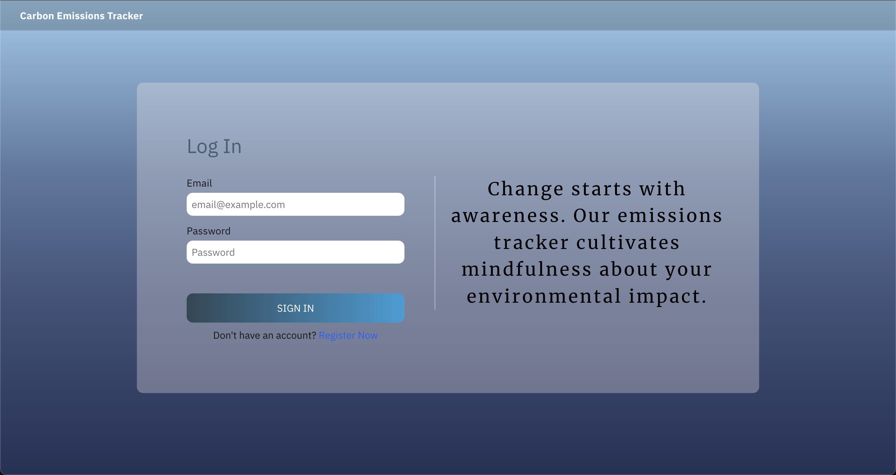

# Carbon Emission Tracker

## Description

The Carbon Emission Tracker is a web application that allows users to estimate carbon emissions for different activities, including electricity usage, fuel combustion, and flight distances. It leverages the [Carbon Interface API](https://docs.carboninterface.com/#/) to provide accurate carbon emission estimates based on user input.

## Problems and Solutions

### Problem

The increasing levels of carbon emissions have a significant impact on our planet, contributing to global warming, climate change, and environmental degradation. Individuals and businesses often struggle to understand their carbon footprint and the impact of their activities on the environment.

### Solution

The Carbon Emission Tracker project was created to address the need for easy and accurate estimation of carbon emissions. By providing a user-friendly interface that leverages the Carbon Interface API, this project enables users to make informed decisions about their energy consumption, travel choices, and daily activities.

#### Benefits

1. **Awareness**: The tracker raises awareness about the environmental impact of everyday activities, helping users understand the carbon emissions associated with their choices.

2. **Informed Decisions**: Armed with accurate estimates, users can make more sustainable choices, such as reducing electricity consumption, opting for greener transportation, or choosing energy-efficient appliances.

3. **Data-Driven Action**: Businesses and individuals can use the emission estimates to set reduction goals, track progress, and contribute to carbon neutrality.

4. **Education**: The project also serves as an educational tool, helping users learn about carbon emissions, their sources, and ways to mitigate them.

## Features

- Estimate carbon emissions for electricity consumption
- Estimate carbon emissions from fuel combustion
- Estimate carbon emissions for flight distances
- Real-time data retrieval and estimation using the Carbon Interface API

## Technologies Used

- React.js
- Next.js
- Firebase Authentication
- SweetAlert2 for notifications
- [Carbon Interface API](https://docs.carboninterface.com/#/)

## Usage

1. Access the web application through your browser.
2. Choose the type of carbon estimate you want (electricity, fuel combustion, or flight).
3. Enter the required data (e.g., electricity unit, flight distance, etc.).
4. Click the "Get Estimate" button to calculate and display the estimated carbon emissions.

## Future Enhancements

- Enhance the user interface with data visualization to present emission estimates more effectively.
- Expand the range of activities covered, including dietary choices, waste management, and more.
- Provide tips and suggestions for reducing carbon emissions associated with various activities.
- Implement user accounts to allow users to save and track their emission estimates over time.